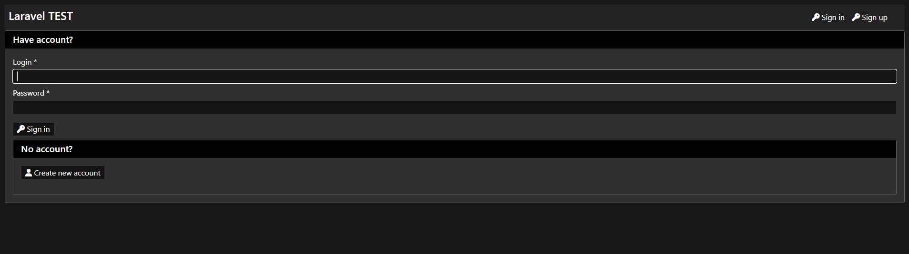
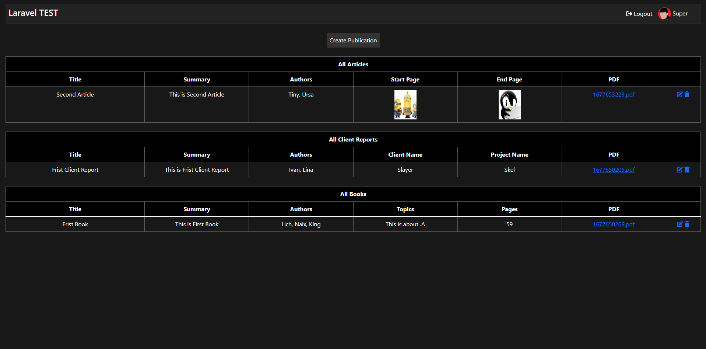

<h1 style="color:blue">Registration of Publicaiton Made with Laravel</h1>

<h2 style="color:cyan">Installation</h2>
<ul>
    <li>Clone the Repo:   </li>
    <li style=""> > git clone https://github.com/superdev214/Laravel_Job_Test.git</li>
    <li> > cd Laravel_Job_Test</li>
    <li> > composer install</li>
    <li> > cp .env.example .env</li>
    <li> > Set up .env file</li>
    <li> > php artisan key:generate</li>
    <li> > php artisan migrate:fresh --seed</li>
    <li> > php artisan serve</li>
    <li> <a href="http://127.0.0.1:8000/">http://127.0.0.1:8000/</a> </li>
    </ul>
    
If you like this project please leave a star ❤

